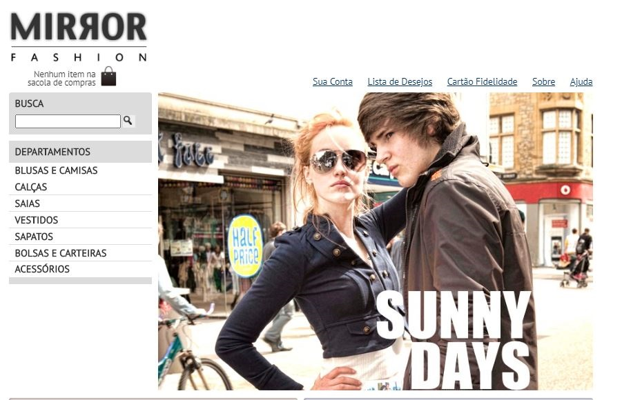

<h1 align="center">
   
    
   
   
    Mirror Fashion
</h1>

 Website de comércio eletrônico de uma empresa fictícia de moda 

 <h2 align="center">:rocket: Features</h2>
 
- **HTML5**
- **CSS 3**
- **Javascript**
- **Bootstrap**
- **JQuery**

<h2 align="center">To Do</h2>
  <ul>
    <li>Incluir links no cabeçalho da página sobre</li>
    <li>Incluir rodapé na página sobre</li>
    <li>Reduzir o topo do cabeçalho</li>
    <li>Padronizar cabeçalho e rodapé</li>
    <li>Incluir espaçamento na tabela de produtos</li>
  </ul>

  

